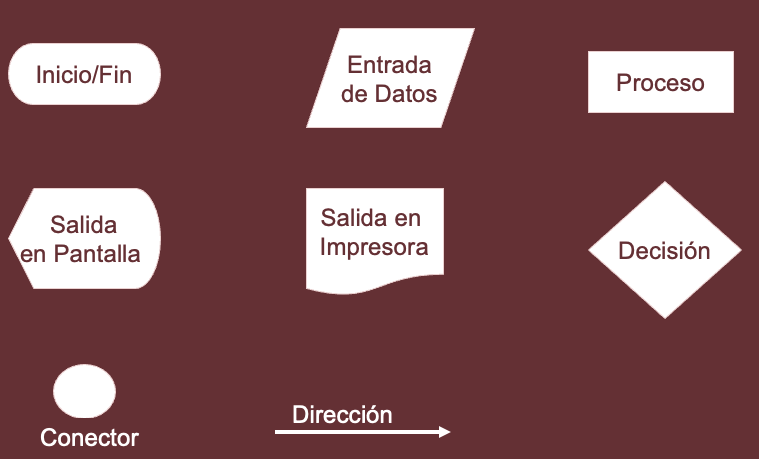
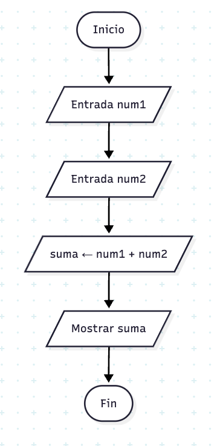

## Algoritmos y Notaciones
Semestre 02, 2025


### Introducción


Un algoritmo es la base de toda solución computacional.  
Permite resolver problemas de forma estructurada y eficiente.


### Algoritmo


Método para resolver un problema mediante una serie de pasos precisos, definidos y finitos.


Deriva de Al-Khwarizmi, considerado el padre de la algoritmia.


Ejemplos: receta de cocina, instrucciones para armar un mueble.


### Propiedades de un algoritmo


**Preciso:** Cada paso claramente definido.


**Definido:** Repetir el algoritmo produce siempre el mismo resultado.


**Finito:** Termina en un número limitado de pasos.


**No ambiguo:** Siempre se sabe qué acción tomar.


**Eficiente:** Idealmente optimiza tiempo y recursos.


### Representaciones


### Narrativa


#### Preparar una taza de té
1. Tomar la tetera
2. Llenarla de agua
3. Encender la estufa
4. Colocar la tetera en la estufa
5. Esperar hasta que el agua hierva
6. Colocar una bolsa de té en una taza
7. Verter el agua hirviendo en la taza
8. Si desea azúcar, añadir 2 cucharaditas
9. Fin


### Diagramas de flujo


Representación gráfica del algoritmo.
Utiliza símbolos para acciones y flechas para indicar flujo.


#### Símbolos estándar
- **Óvalo:** Inicio/Fin
- **Paralelogramo:** Entrada/Salida
- **Rectángulo:** Proceso
- **Rombo:** Decisión
- **Conector:** Puntos de conexión








### Pseudocódigo

Casi código pero no del todo.

```plaintext
Inicio
    Leer num1
    Leer num2
    suma ← num1 + num2
    Escribir suma
Fin