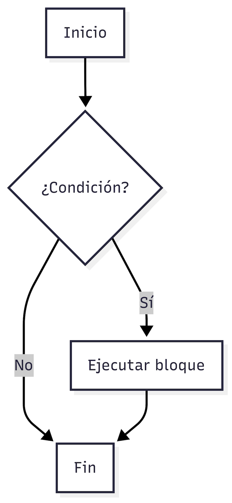

# Estructuras Condicionales
Semestre 02, 2025


## Introducción


Los condicionales permiten que un programa tome decisiones según ciertas condiciones.
El condicional `if` evalúa si una expresión es verdadera. Si lo es, se ejecuta el bloque de código asociado.


El uso de condicionales permite que nuestros programas sean dinámicos y respondan de forma distinta según los datos. `if` y `else` son herramientas esenciales para la lógica en programación.


## Expresiones booleanas


Una **expresión booleana** es una expresión que se evalúa como `True` o `False`.
Estas expresiones son fundamentales para tomar decisiones usando `if`.


### Ejemplos:

```python[]
x = 5

print(x > 3)     # True
print(x == 10)    # False
print((x % 2) == 1)  # True (x es impar)
```


También podemos combinarlas con operadores lógicos:

```python[]
x = 7
y = 10

print((x > 5) and (y < 20))   # True
print(not(x == y))            # True
```


## Sintaxis


```python[]
if condicion:
    # bloque de código
```


### Ejemplo

```python[]
edad = 20

if edad >= 18:
    print("Eres mayor de edad")
```


### Diagráma de Flujo




## Sangría (indentación)


La indentación es obligatoria en Python. El bloque de código dentro del `if` debe estar tabificado.


```python[]
if True:
    print("Esto se imprime")
```


## Alternativas


No siempre solo tengo una opción, muchas veces tengo al menos 2.


```python[]
if condicion:
    # bloque si se cumple
else:
    # bloque si no se cumple
```


### Ejemplo

```python[]
numero = 7

if numero % 2 == 0:
    print("Es par")
else:
    print("Es impar")
```


### Diagráma de Flujo


## Anidación de condicionales


Es posible colocar un `if` dentro de otro.


```python[]
numero = 0

if numero >= 0:
    if numero == 0:
        print("Es cero")
    else:
        print("Es positivo")
else:
    print("Es negativo")
```


## Buenas prácticas


* Comentar la lógica si es compleja.
* Evitar condicionales anidados innecesarios.
* Usar paréntesis para agrupar condiciones complejas.


## Errores comunes


1. **Falta de indentación**:

```python[]
if True:
print("Esto falla")  # Error de indentación
```


2. **Usar `=` en lugar de `==` para comparación**:

```python[]
if x = 5:   # Error de sintaxis
```


3. **Olvidar los dos puntos**:

```python[]
if x > 3    # SyntaxError: expected ':'
    print("OK")
```


4. **No convertir tipos antes de comparar**:

```python[]
edad = input("Edad: ")
if edad >= 18:  # Error: compara str con int
```


## Ejemplos


### Ejemplo 1 – Verificar número positivo

```python[]
numero = int(input("Ingrese un número: "))

if numero > 0:
    print("El número es positivo")
else:
    print("El número no es positivo")
```


### Ejemplo 2 – Verificar si un número es par

```python[]
numero = int(input("Ingrese un número: "))

if numero % 2 == 0:
    print("Es una vocal")
else:
    print("No es una vocal")
```


### Ejemplo 3 – Verificar rango de edad

```python[]
edad = int(input("Ingrese su edad: "))

if edad >= 18 and edad <= 25:
    print("Estás en el rango joven-adulto")
else:
    print("Fuera del rango")
```