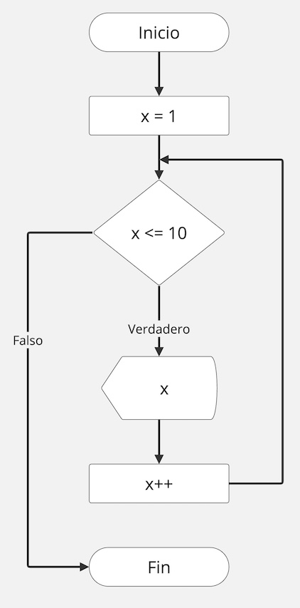

# Estructuras de Repetición
Semestre 02, 2025


## Definición

Una estructura cíclica permite repetir las instrucciones definidas en un bloque de código. Lo que hace que los programas sean más optimizados.


## Tipos

Existen 2 tipos de estructuras cíclicas:

1. Por condición
2. Por cantidad de repeticiones


Para ambos tipos se utiliza una variable de control. Esta variable es la que guarda el valor de la iteración o la que se evalúa en la condición.


## Diagrama


Diagrama de flujo de las estructuras de repetición:




## Ciclos por condición


Los ciclos por condición son aquellos que se repiten mientras la condición se cumple. Se detienen cuando la condición deja de cumplirse.


Existen 2 variantes: con condición al inicio (while) y con condición al final (do while).


### While


Como su nombre lo indica en español el ciclo While o Mientras se ejecuta siempre y cuando la condición sea verdadera.


Estos ciclos se utilizan generalmente cuando no sabemos cuantas veces se va a repetir el bloque de código.


En este ciclo la condicional se encuentra primero.

```python[]
while condicion:
    # inicia bloque de codigo
```


```python[]
x = 1

while x <= 10:
    print("El valor de x es:", x)
    x = x + 1
```

¿Cuantas veces se imprime el valor de x?

¿Qué pasa si nunca hacemos el `x = x + 1` ?

